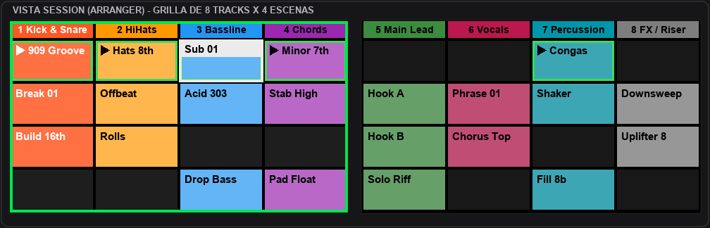
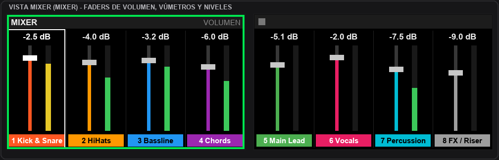
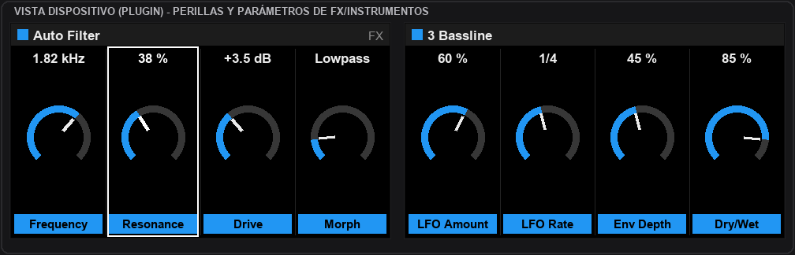
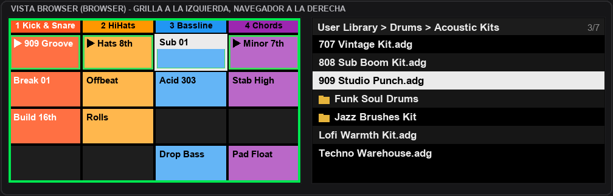

# 🎹 Maschine MK3 as Ableton Push

[](https://www.ableton.com)
[](https://www.native-instruments.com)
[](https://microsoft.com)
[](LICENSE)

Convertí tu **Maschine MK3** en un potente controlador al estilo **Ableton Push** para **Live 12**:
- 📺 **Grilla de clips en tiempo real** en las dos pantallas a color.
- 🎛️ **Navegación tipo Push**: lanzá clips y escenas con el encoder 4D.
- 🎚️ **Mixer gráfico**: faders verticales, medidores de nivel (vúmetros) dinámicos y paneo estéreo.
- 🔌 **Control de dispositivos y plugins**: perillas con valores y nombres sincronizados.
- 📁 **Browser visual**: lista de carpetas a la derecha y grilla de destino a la izquierda.
- 🛑 **Modo Reposo inteligente**: protege las pantallas y evita toques accidentales.

---

## 📸 Vistas en las Pantallas de Ableton

Las dos pantallas de la Maschine MK3 muestran la interfaz gráfica nativa de Ableton en vivo:

### 1. Vista Session (`ARRANGER`)
Grilla completa de **8 pistas × 4 escenas** con los nombres y colores reales de tus clips. Un marco verde destaca las 4 pistas asignadas a los pads (zonas A–H) y un cursor blanco marca el clip seleccionado en Live. Los clips en reproducción se identifican con un borde verde.



---

### 2. Vista Mixer (`MIXER`)
Faders verticales por canal, vúmetros con graduación verde/amarillo/rojo, paneo estéreo y niveles exactos en dB. Las pistas llevan su color correspondiente y el marco verde indica las pistas vinculadas a los pads.



---

### 3. Vista Dispositivo / Plugins (`PLUGIN`)
Las 8 perillas toman los parámetros del instrumento o efecto de audio seleccionado. Muestra el nombre del dispositivo, el color asignado a la cadena o pista y los valores exactos en tiempo real (frecuencia, resonancia, drive, dry/wet, etc.).



---

### 4. Vista Browser (`BROWSER`)
Navegador de sonidos integrado: la pantalla izquierda mantiene la grilla de sesión para ver exactamente dónde caerá el elemento seleccionado, mientras la pantalla derecha permite explorar tu **User Library**, carpetas y presets cómodamente con el encoder.



---

## 🎮 Guía Rápida de Controles

### 🛑 Reposo (Standby)
Para cuidar las pantallas y evitar toques accidentales cuando no estés tocando:

| Control | Acción |
|---|---|
| **SHIFT + CHANNEL** | Pasa a reposo: apaga pads y botones, y muestra el salvapantallas con logo. |
| **CHANNEL** | Despierta la controladora. |
| **MIXER** / **PLUGIN** / **ARRANGER** | Despiertan la controladora y van directamente a esa vista. |

---

### 🔲 Vistas Principales

| Botón | Vista |
|---|---|
| **ARRANGER** | **Vista Session:** grilla de clips en las dos pantallas. |
| **MIXER** | **Vista Mixer:** faders, medidores de nivel, paneo y envíos de 8 pistas. |
| **PLUGIN** | **Vista Dispositivo:** perillas del plugin o efecto seleccionado. |
| **BROWSER** | **Vista Browser:** lista en pantalla derecha, grilla en pantalla izquierda. |

---

### 🕹️ Navegación de Clips y Escenas (Estilo Push)

| Control | Acción |
|---|---|
| **Girar rueda (Encoder)** | Mover el cursor de pista en pista. |
| **Inclinar rueda (Arriba / Abajo)** | Mover el cursor de escena en escena. |
| **Apretar rueda** | Lanzar el clip (o disparar la celda) bajo el cursor. |
| **SHIFT + girar / inclinar** | Desplazar manualmente la grilla y pads (4 pistas al costado, 1 escena arriba/abajo). |
| **Botones A–H** | Saltar rápido de a 4 pistas: A (1-4), B (5-8), C (9-12), etc. |
| **Botones ◀ / ▶** | En vista Session, alternan las 8 perillas entre volumen de pistas y parámetros del dispositivo. |
| **VARIATION** | **Borrar clip:** elimina el clip bajo el cursor en vista Session (o el último grabado en otras vistas; recuperable con `Ctrl+Z`). |
| **EVENTS** | **Crear escena:** inserta una nueva escena debajo de la actual, detiene el clip de esa pista y ubica el cursor allí. |

---

### 🎛️ Atajos y Modificadores en Perillas

| Combinación | Acción |
|---|---|
| **RESTART + tocar perilla** | Restablece el parámetro a su valor por defecto (en mixer: 0 dB). |
| **ERASE + doble toque** | Lleva el parámetro a cero (paneo al centro, etc.). |
| **SHIFT + RESTART** | Restablece todos los volúmenes del mixer a su valor por defecto (el Master no se modifica). |
| **MUTE + tocar perilla** | Detiene el clip que está sonando en la pista de esa perilla. |
| **SOLO + tocar perilla** | Activa o desactiva la preescucha (Solo) de esa pista. |
| **RESTART + SOLO** | Desactiva todas las preescuchas activas. |
| **FOLLOW + tocar perilla** | Dispara el clip de esa pista en la escena donde está posicionado el cursor. |

---

### 🔊 Volumen Master, Auriculares y Tempo

Al presionar cualquiera de estos botones, el encoder principal toma el control y la pantalla derecha muestra el valor numérico y gráfico:
- **VOLUME:** Volumen Master.
- **SWING:** Volumen de auriculares / preescucha (Cue).
- **TEMPO:** Tempo general en BPM.
- Presionar cualquier botón de vista o pad apaga este modo.

---

## 📦 Estructura del Repositorio

| Carpeta | Descripción |
|---|---|
| [`Ableton/CustomMaschineMK3`](Ableton/CustomMaschineMK3) | Script de superficie de control para Ableton Live 12. |
| [`Controller Editor`](Controller%20Editor) | Plantilla MIDI personalizada (`Configuration.ncc`) para Controller Editor. |
| [`Pantallas`](Pantallas) | Aplicación que dibuja en las pantallas de la Maschine (USB WinUSB). |
| [`docs/images`](docs/images) | Capturas y diagramas de las pantallas en Ableton Live. |
| [`tools`](tools) | Utilidades de diagnóstico, registros y generador de capturas. |

---

## 🚀 Instalación y Puesta en Marcha

### Requisitos Previos
- **Windows 11** (o Windows 10 con soporte MIDI).
- **Ableton Live 12 Suite**.
- **Maschine MK3** con **NI Controller Editor**.
- **Python 3.12** y **[Zadig](https://zadig.akeo.ie/)** (para la aplicación de pantallas).

---

### Paso 1: Controller Editor
1. Cerrar Controller Editor.
2. Copiar `Controller Editor/Configuration.ncc` en `Documentos\Native Instruments\Controller Editor\`.
3. Abrir Controller Editor y seleccionar en la Maschine la plantilla **CUSTOM MASCHINE**.

### Paso 2: Script de Ableton
1. Copiar la carpeta `Ableton/CustomMaschineMK3` dentro de:  
   `C:\ProgramData\Ableton\Live 12 Suite\Resources\MIDI Remote Scripts\`
2. En Ableton Live (*Opciones → Preferencias → Link, Tempo & MIDI*):
   - **Control Surface:** `CustomMaschineMK3`
   - **Input:** `Maschine MK3 Ctrl MIDI`
   - **Output:** `Maschine MK3 Ctrl MIDI`

### Paso 3: Driver y Programa de Pantallas
1. Abrir **Zadig** (*Options → List All Devices*):
   - Asignar el driver **WinUSB** **únicamente** a **`Maschine MK3 BD (Interface 5)`**.
   - ⚠️ *No modificar las otras interfaces (0, 4 ni 6).*
   - Desconectar y volver a conectar el cable USB de la Maschine.
2. Compilar el ejecutable desde la carpeta `Pantallas`:
   ```bash
   cd Pantallas
   python -m venv .venv
   .venv\Scripts\pip install -r requirements.txt
   construir_exe.bat
   ```
3. Ejecutar `MaschineMK3AsPush.exe` (corre en segundo plano y se reinicia automáticamente ante cualquier reconexión).

---

## 📝 Diagnóstico y Registros

Para ver los registros de Ableton y de las pantallas en tiempo real:
```bash
python tools/registros.py [minutos] [filtro]
```

---

## 📄 Créditos y Licencia

Desarrollado y optimizado por **Santiago Jorda**.  
Basado originalmente en el script de control de *CustomMaschineMK3* (© 2024–2025 chiaki).

Distribuido bajo licencia libre **GNU General Public License v3.0**. Consulta el archivo [`LICENSE`](LICENSE) para más información.
