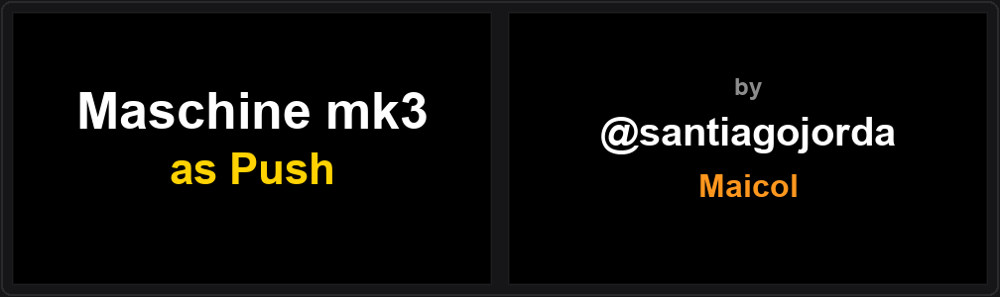

# 🎹 Maschine MK3 as Ableton Push

[](https://www.ableton.com)
[](https://www.native-instruments.com)
[](https://microsoft.com)
[](https://github.com/santiagojorda/maschine-mk3-driver)
[-brightgreen.svg)](https://github.com/santiagojorda/maschine-mk3-driver/releases/latest)
[-brightgreen.svg)](https://santiagojorda.github.io/maschine-mk3-as-ableton-push/)
[](https://www.youtube.com/watch?v=ImqHw-zkiZQ&list=PLxk2dEOPjuEYO00P264yMStEUhukVkO1y)
[](http://instagram.com/santiagojorda)



Convertí tu **Maschine MK3** en un potente controlador al estilo **Ableton Push** para **Live 12**:
- 📺 **Grilla de clips en tiempo real** en las dos pantallas a color.
- 🎛️ **Navegación tipo Push**: lanzá clips y escenas con el encoder 4D.
- 🎚️ **Mixer gráfico**: faders verticales, medidores de nivel (vúmetros) dinámicos y paneo estéreo.
- 🔌 **Control de dispositivos y plugins**: perillas con valores y nombres sincronizados.
- 📁 **Browser visual**: lista de carpetas a la derecha y grilla de destino a la izquierda.
- 🛑 **Modo Reposo inteligente**: protege las pantallas y evita toques accidentales.

> 📖 **[Ver Manual Web de Todas las Operaciones](https://santiagojorda.github.io/maschine-mk3-as-ableton-push/)**: guía visual interactiva completa con diagramas de botones y perillas.

---

### 🎵 El Origen: Maicol Sessions
Todo esto nació de mis sesiones combinando **Maschine MK3** y **Ableton Live**: una combinación tremenda donde el sampler de Maschine es insuperable por su comodidad y versatilidad con sus perillas dedicadas, pero faltaba ese control fluido estilo Push para manejar todo el set sin tocar el mouse.

Como **ingeniero informático** y como **músico**, para mí era natural ponerme a programar soluciones a medida para mi propio workflow: unir el software con el hardware para transformar la Maschine en la herramienta definitiva a la hora de producir y tocar en vivo.

[](https://www.youtube.com/watch?v=ImqHw-zkiZQ&list=PLxk2dEOPjuEYO00P264yMStEUhukVkO1y)

- 📺 **YouTube Playlist:** [Maicol Session: Ableton Push + Maschine MK3](https://www.youtube.com/watch?v=ImqHw-zkiZQ&list=PLxk2dEOPjuEYO00P264yMStEUhukVkO1y)
- 📸 **Instagram:** [@santiagojorda](http://instagram.com/santiagojorda)

---

## 📸 Vistas en las Pantallas de Ableton

Las dos pantallas de la Maschine MK3 muestran la interfaz gráfica nativa de Ableton en vivo:

### 1. Vista Session (<kbd>ARRANGER</kbd>)
Grilla completa de **8 pistas × 4 escenas** con los nombres y colores reales de tus clips. Un marco verde destaca las 4 pistas asignadas a los pads (zonas A–H) y un cursor blanco marca el clip seleccionado en Live. Los clips en reproducción se identifican con un borde verde.


---

### 2. Vista Mixer (<kbd>MIXER</kbd>)
Faders verticales por canal, vúmetros con graduación verde/amarillo/rojo, paneo estéreo y niveles exactos en dB. Las pistas llevan su color correspondiente y el marco verde indica las pistas vinculadas a los pads.


---

### 3. Vista Dispositivo / Plugins (<kbd>PLUGIN</kbd>)
Las 8 perillas toman los parámetros del instrumento o efecto de audio seleccionado. Muestra el nombre del dispositivo, el color asignado a la cadena o pista y los valores exactos en tiempo real (frecuencia, resonancia, drive, dry/wet, etc.).


---

### 4. Vista Browser (<kbd>BROWSER</kbd>)
Navegador de sonidos integrado: la pantalla izquierda mantiene la grilla de sesión para ver exactamente dónde caerá el elemento seleccionado, mientras la pantalla derecha permite explorar tu **User Library**, carpetas y presets cómodamente con el encoder.


---

## 🎮 Guía Rápida de Controles

> 💡 **¿Buscás más operaciones y funciones avanzadas?**  
> Para consultar el catálogo completo con más de 100 operaciones interactivas (Drum Rack, Simpler slicing, escalas, acordes, step sequencer, automatizaciones y edición de clips), ingresá al **[Manual Web: All Operations](https://santiagojorda.github.io/maschine-mk3-as-ableton-push/)**.

### 🛑 Reposo (Standby)
Para cuidar las pantallas y evitar toques accidentales cuando no estés tocando:

| Botón / Control | Acción |
|---|---|
| <kbd>SHIFT</kbd> + <kbd>CHANNEL</kbd> | Pasa a reposo: apaga pads y botones, y muestra el salvapantallas con logo. |
| <kbd>CHANNEL</kbd> | Despierta la controladora al modo activo. |
| <kbd>MIXER</kbd> / <kbd>PLUGIN</kbd> / <kbd>ARRANGER</kbd> | Despiertan la controladora y van directamente a esa vista. |

---

### 🔲 Vistas Principales

| Botón | Vista |
|---|---|
| <kbd>ARRANGER</kbd> | **Vista Session:** grilla de clips en las dos pantallas a color. |
| <kbd>MIXER</kbd> | **Vista Mixer:** faders verticales, medidores de nivel dinámicos, paneo y envíos de 8 pistas. |
| <kbd>PLUGIN</kbd> | **Vista Dispositivo:** 8 perillas con parámetros del plugin o efecto seleccionado. |
| <kbd>BROWSER</kbd> | **Vista Browser:** lista en pantalla derecha, grilla de destino en pantalla izquierda. |
| <kbd>SAMPLING</kbd> | **Editor de Clips:** recorte, warp, ganancia, transposición y loop. |
| <kbd>SETTINGS</kbd> | **Ajustes:** opciones de configuración y visualización en pantallas. |

---

### 🕹️ Navegación de Clips y Escenas (Estilo Push)

| Botón / Control | Acción |
|---|---|
| <kbd>Girar Encoder</kbd> | Mover el cursor de pista en pista (izquierda / derecha). |
| <kbd>Inclinar Encoder</kbd> (▲ / ▼) | Mover el cursor de escena en escena (arriba / abajo). |
| <kbd>Apretar Encoder</kbd> | Lanzar el clip (o disparar la celda) bajo el cursor. |
| <kbd>SHIFT</kbd> + <kbd>Encoder</kbd> | Desplazar manualmente la grilla y pads (4 pistas al costado, 1 escena arriba/abajo). |
| <kbd>A</kbd>–<kbd>H</kbd> | Saltar rápido de a 4 pistas: <kbd>A</kbd> (1-4), <kbd>B</kbd> (5-8), <kbd>C</kbd> (9-12), etc. |
| <kbd>◀</kbd> / <kbd>▶</kbd> | En vista Session, alternan las 8 perillas entre volumen de pistas y parámetros del dispositivo. |
| <kbd>Pads 1–16</kbd> | Matriz 4×4 para disparar clips de las 4 pistas asignadas. |
| <kbd>VARIATION</kbd> | **Borrar clip:** elimina el clip bajo el cursor en vista Session (o el último grabado en otras vistas; recuperable con `Ctrl+Z`). |
| <kbd>EVENTS</kbd> | **Crear escena:** inserta una nueva escena debajo de la actual, detiene el clip de esa pista y ubica el cursor allí. |

---

### 🎛️ Atajos y Modificadores en Perillas

| Botón / Combinación | Acción |
|---|---|
| <kbd>RESTART</kbd> + tocar <kbd>Perilla 1–8</kbd> | Restablece el parámetro a su valor por defecto (en mixer: 0 dB). |
| <kbd>ERASE</kbd> + doble toque <kbd>Perilla 1–8</kbd> | Lleva el parámetro a cero (paneo al centro, etc.). |
| <kbd>SHIFT</kbd> + <kbd>RESTART</kbd> | Restablece todos los volúmenes del mixer a su valor por defecto (el Master no se modifica). |
| <kbd>MUTE</kbd> + tocar <kbd>Perilla 1–8</kbd> | Detiene el clip que está sonando en la pista de esa perilla. |
| <kbd>SOLO</kbd> + tocar <kbd>Perilla 1–8</kbd> | Activa o desactiva la preescucha (Solo) de esa pista. |
| <kbd>RESTART</kbd> + <kbd>SOLO</kbd> | Desactiva todas las preescuchas activas simultáneamente. |
| <kbd>FOLLOW</kbd> + tocar <kbd>Perilla 1–8</kbd> | Dispara el clip de esa pista en la escena donde está posicionado el cursor. |
| <kbd>MACRO</kbd> (mantener) + <kbd>Perilla 1–8</kbd> | Ajuste fino de precisión del parámetro. |

---

### ⏯️ Transporte y Atajos Rápidos

| Botón / Combinación | Acción |
|---|---|
| <kbd>PLAY</kbd> | Iniciar / pausar reproducción en Ableton Live. |
| <kbd>REC</kbd> | Activar grabación en Session o Arrangement. |
| <kbd>STOP</kbd> | Detener reproducción general. |
| <kbd>SHIFT</kbd> + <kbd>Pad 1</kbd> | **Deshacer (Undo)** la última acción. |
| <kbd>SHIFT</kbd> + <kbd>Pad 2</kbd> | **Rehacer (Redo)** la última acción deshecha. |
| <kbd>DUPLICATE</kbd> | Duplicar el clip seleccionado (o duplicar la longitud del loop). |

---

### 🔊 Volumen Master, Auriculares y Tempo

Al presionar cualquiera de estos botones, el encoder principal toma el control y la pantalla derecha muestra el valor numérico y gráfico:
- <kbd>VOLUME</kbd> : Volumen Master.
- <kbd>SWING</kbd> : Volumen de auriculares / preescucha (Cue).
- <kbd>TEMPO</kbd> : Tempo general en BPM.
- *(Presionar cualquier botón de vista o pad apaga este modo).*

---

## 🌐 Ver Más Operaciones en la Web

La Maschine MK3 tiene implementadas **más de 100 operaciones** para controlar Ableton Live en profundidad. Para ver la guía completa interactiva con diagramas visuales de hardware:

👉 **[Ingresar a la Web de Operaciones Completas](https://santiagojorda.github.io/maschine-mk3-as-ableton-push/)**

En la web vas a encontrar el detalle de:
- 🥁 **Drum Rack & Simpler:** Mapeo de pads, rebanado de audio (Slicing) y manipulación de samples.
- 🎹 **Escalas y Acordes:** Modos armónicos, notas raíz, transposiciones y arpegios en tiras táctiles.
- 🎚️ **Edición de Clips:** Modos warp, transposición de semitonos, ganancia y puntos de inicio de loop.
- 🎼 **Step Sequencer:** Secuenciación por pasos en la matriz de pads con longitud y división métrica.
- 📂 **Browser Visual:** Navegación por colecciones de colores, hotswap y preescucha de librerías.
- ⚙️ **Configuración:** Brillo de pantallas, sensibilidad de pads y curvas de respuesta.

---

## 🚀 Instalación Rápida (3 Pasos)

> 💡 **Requisitos:** Windows 10/11, Ableton Live 12 Suite y Maschine MK3 conectada por USB.

### 1️⃣ Plantilla en Controller Editor
1. Cerrá **Controller Editor**.
2. Copiá el archivo `Controller Editor/Configuration.ncc` en:  
   `Documentos\Native Instruments\Controller Editor\`
3. Abrí **Controller Editor** y en la Maschine seleccioná la plantilla **CUSTOM MASCHINE**.

### 2️⃣ Script en Ableton Live
1. Copiá la carpeta `Ableton/CustomMaschineMK3` como `Maschine as Push` (o `Maschine_as_Push`) dentro de:  
   `C:\ProgramData\Ableton\Live 12 Suite\Resources\MIDI Remote Scripts\`
2. En Ableton Live (*Opciones → Preferencias → Link, Tempo & MIDI*):
   - **Superficie de control:** `Maschine as Push` *(o `Maschine_as_Push`)*
   - **Entrada:** `Maschine MK3 Ctrl MIDI`
   - **Salida:** `Maschine MK3 Ctrl MIDI`

### 3️⃣ Pantallas de la Maschine (Driver)
El servidor de pantallas y el ejecutable oficial `MaschineMK3AsPush.exe` se mantienen en el repositorio complementario **[santiagojorda/maschine-mk3-driver](https://github.com/santiagojorda/maschine-mk3-driver)**:

1. **Driver USB (solo la primera vez):**
   - Abrí el programa gratuito **[Zadig](https://zadig.akeo.ie/)** (*Options → List All Devices*).
   - Seleccioná **`Maschine MK3 BD (Interface 5)`**, elegí **WinUSB** y hacé clic en **Install Driver** *(no toques las otras interfaces)*. Desconectá y volvé a conectar el cable USB.
2. **Encender las pantallas:**
   - Descargá el ejecutable listo para usar desde **[Releases de maschine-mk3-driver](https://github.com/santiagojorda/maschine-mk3-driver/releases/latest)** o ejecutá `Pantallas\iniciar_pantallas.bat`.
   - ¡Listo! Las pantallas se encenderán mostrando la sesión de Live.

---

## 🔄 Cómo Volver al Uso Normal de la Maschine

Si querés usar la Maschine MK3 como siempre con el software oficial de **Native Instruments** (Maschine 2 / Komplete):

### 1. En el día a día (sin desinstalar nada)
1. **Cerrá las pantallas:** Cerrá la ventana de `iniciar_pantallas.bat` (o cerrá `MaschineMK3AsPush.exe`).
2. **Volver al software Maschine:**
   - Abrí el software **Maschine 2**.
   - En el controlador, presioná <kbd>SHIFT</kbd> + <kbd>CHANNEL</kbd> (MIDI) para alternar entre el modo MIDI y el modo nativo del software Maschine.
   - ¡Listo! Todo vuelve a funcionar exactamente como viene de fábrica.

### 2. Restaurar el driver original de NI (si alguna vez querés quitar WinUSB)
Si en algún momento querés dejar la Maschine de fábrica al 100% y retirar el driver WinUSB de la interfaz 5:
1. Abrí el **Administrador de Dispositivos** de Windows (`devmgmt.msc`).
2. Buscá en *Dispositivos de bus serie universal* (o *Universal Serial Bus devices*) la entrada **`Maschine MK3 BD (Interface 5)`**.
3. Hacé clic derecho → **Desinstalar el dispositivo** (marcando la casilla de eliminar el controlador).
4. Desconectá y volvé a conectar el cable USB de la Maschine. Windows reinstalará automáticamente el driver original oficial de Native Instruments.

---

## 📝 Diagnóstico y Registros

Para ver los registros de Ableton y de las pantallas en tiempo real:
```bash
python tools/registros.py [minutos] [filtro]
```

---

## 👤 Creador y Créditos

- **Desarrollo y concepto:** Santiago Jorda (Maicol) — Ingeniero Informático & Músico  
  - 📺 [Maicol Session en YouTube](https://www.youtube.com/watch?v=ImqHw-zkiZQ&list=PLxk2dEOPjuEYO00P264yMStEUhukVkO1y)  
  - 📸 Instagram: [@santiagojorda](http://instagram.com/santiagojorda)
- **Base del script:** *CustomMaschineMK3* (chiaki).
